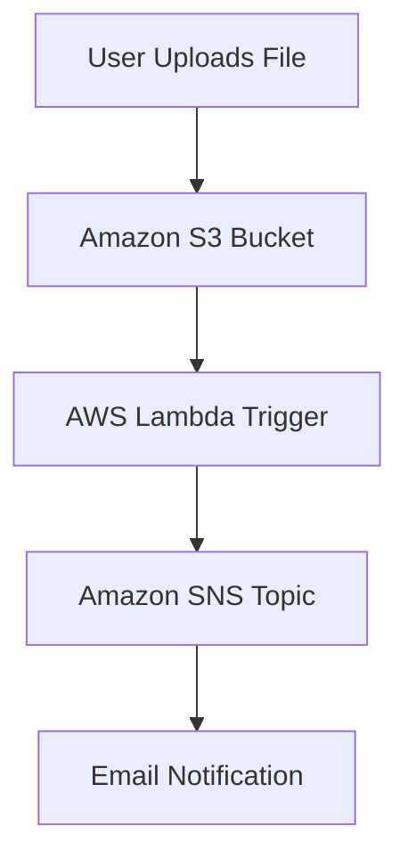

# aws-serverless-file-notifier

## Project Overview

A beginner-friendly AWS serverless project that automatically sends an email notification whenever a file is uploaded to an Amazon S3 bucket.

This project demonstrates an event-driven serverless architecture using AWS services.

---

## Architecture

```text
User Upload
    ↓
Amazon S3
    ↓
AWS Lambda Trigger
    ↓
Amazon SNS
    ↓
Email Notification
```

---

## Architecture Diagram (GitHub Mermaid)



---

## Features

✅ Upload file to S3 bucket
✅ Automatic Lambda trigger using S3 event
✅ SNS email notification
✅ CloudWatch logging for debugging
✅ Event-driven serverless workflow
✅ Free-tier friendly and low-cost

---

## AWS Services Used

| Service    | Purpose                    |
| ---------- | -------------------------- |
| Amazon S3  | Stores uploaded files      |
| AWS Lambda | Processes S3 upload events |
| Amazon SNS | Sends email notifications  |
| IAM        | Manages permissions        |
| CloudWatch | Logs and monitoring        |

---

## Project Workflow

1. User uploads a file to S3 bucket
2. S3 generates an ObjectCreated event
3. Lambda function is triggered automatically
4. Lambda extracts file details
5. Lambda publishes a message to SNS
6. SNS sends an email notification

---

## Project Structure

```text
aws-serverless-file-notifier/
│
├── lambda_function.py
├── README.md
├── architecture.png
└── screenshots/
    ├── s3-bucket.png
    ├── lambda-overview.png
    ├── sns-topic.png
    └── email-notification.png
```

---

## Lambda Function Code

```python
import json
import boto3
import urllib.parse

sns = boto3.client('sns')

TOPIC_ARN = 'YOUR_SNS_TOPIC_ARN'

def lambda_handler(event, context):

    print("Event:", event)

    for record in event['Records']:

        bucket = record['s3']['bucket']['name']
        key = urllib.parse.unquote_plus(
            record['s3']['object']['key']
        )

        message = f"""
New file uploaded!

Bucket: {bucket}
File: {key}
"""

        sns.publish(
            TopicArn=TOPIC_ARN,
            Subject='S3 File Upload Alert',
            Message=message
        )

        print("SNS notification sent")

    return {
        'statusCode': 200,
        'body': json.dumps('Success')
    }
```

---

## Setup Instructions

### Step 1 – Create S3 Bucket

* Create private S3 bucket
* Enable default encryption
* Upload a sample file

### Step 2 – Create SNS Topic

* Create Standard SNS topic
* Add email subscription
* Confirm subscription

### Step 3 – Create Lambda Function

* Runtime: Python
* Create execution role
* Deploy Lambda code

### Step 4 – Configure S3 Trigger

* Add S3 trigger
* Event type:

  * ObjectCreated

### Step 5 – Configure Permissions

Attach SNS publish permissions to Lambda IAM role.

### Step 6 – Test

Upload file to S3.

Expected result:

* Lambda triggered
* CloudWatch logs generated
* Email notification received

---

## Sample Output

**Subject:**

```text
S3 File Upload Alert
```

**Message:**

```text
New file uploaded!

Bucket: your-bucket-name
File: test-file.txt
```

---

## Screenshots

Add screenshots here:

### S3 Bucket


### Lambda Overview


### SNS Topic


### Email Notification


---

## Learning Outcomes

This project helped me learn:

* AWS S3
* AWS Lambda
* Amazon SNS
* IAM roles and permissions
* CloudWatch Logs
* Event-driven serverless architecture
* Real-world AWS automation

---

## Cost

This project is AWS Free Tier friendly and designed for low-cost experimentation.

---

## Cleanup

To avoid AWS charges, delete:

* S3 bucket
* Lambda function
* SNS topic and subscription
* CloudWatch log groups

---

## Author

Built as part of AWS and DevOps hands-on learning.
